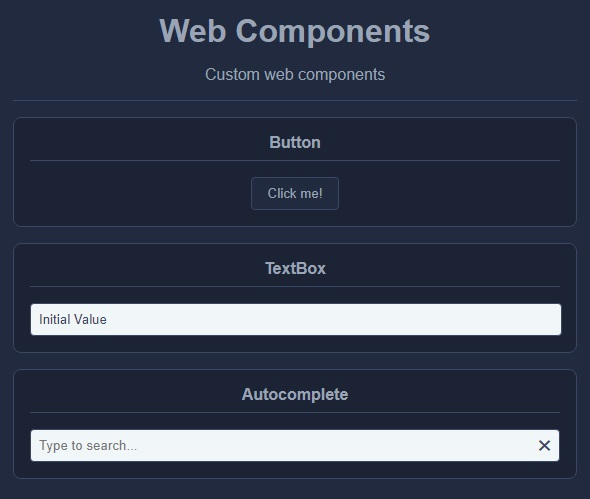

<div align="center">
  
  
  
  <br/>
  <br/>
  <a href="https://github.com/lgneves-dev/kahuak">
    
  </a>
</div>

## Description

Kahuak is a web UI component library developed in vanilla JavaScript. This library aims to provide a collection of reusable and customizable components to facilitate the development of modern and appealing user interfaces.

## Features

* **Reusable Components**: Kahuak offers a variety of ready-to-use components, from buttons and cards to progress bars and forms, which you can easily integrate into your project.

* **Vanilla JavaScript**: The library is written entirely in vanilla JavaScript, meaning there are no external dependencies. This makes it lightweight and easy to integrate into any web project.

* **Highly Customizable**: Each component is highly customizable to fit the specific needs of your project. You can easily modify styles, colors, and behaviors.

## Screenshots

<div align="center">

</div>

## Basic Usage

```html
<!DOCTYPE html>
<html lang="en">
<head>
  <meta charset="UTF-8">
  <meta name="viewport" content="width=device-width, initial-scale=1.0">
  <title>Kahuak UI Components</title>
  <!-- Include the library -->
  <script src="kahuak.all.js"></script>
  <!-- Initialize the component -->
  <script>
    let myComponent = new Autocomplete('my-component', {
        dataSource: [ 'Apple', 'Banana', 'Orange', 'Kiwi', 'Peach'],
        value: 'Orange',
        placeholder: 'Please select a fruit...'
    })
  </script>
</head>
<body>
  <!-- Use the components in your project -->
  <div id="my-component" class="kc-autocomplete"></div>
</body>
</html>
```

## License

Licensed under the [MIT](LICENSE.txt) license.

___

**Note**: This project is under development. It is recommended to regularly check for updates and new features. Thank you for using this web components library!